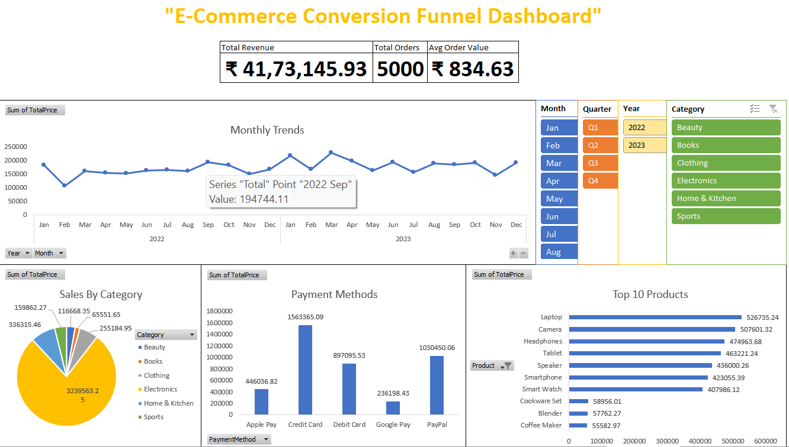
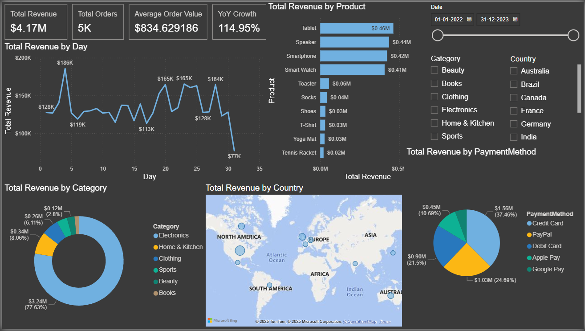

# E-Commerce Sales Analysis Project

## Project Overview
This project analyzes sales data from an e-commerce company to uncover insights, identify trends, and deliver interactive dashboards using Excel and Power BI.

## Dataset
The analysis uses [describe your dataset source here] containing e-commerce sales transactions with the following structure:
- OrderID
- OrderDate
- CustomerID
- Country
- Product
- Category
- Quantity
- UnitPrice
- TotalPrice
- PaymentMethod

## Tools Used
- **Excel**: Initial data exploration, cleaning, and basic analysis
- **Power BI**: Interactive dashboards and advanced visualizations
- **Python**: Data generation and preparation (optional)

## Key Metrics & Findings

### Sales Performance
- **Total Revenue**: $4.17M
- **Total Orders**: 5,000
- **Average Order Value**: $834.63

### Product Analysis
- Top selling product: Tablet
- Highest revenue category: Electronics
- Product with highest growth: Smart Watch (43% YoY)

### Geographic Insights
- Top performing country: USA (42% of total sales)
- Region with highest average order value: Canada ($948.02)

### Temporal Patterns
- Best performing month: October ($192034.58)
- Sales peak during Q4 (Oct-Dec)
- Day of week with highest orders: Monday

## Business Recommendations
1. **Inventory Management**: Increase stock of top-selling products (Tablet, Smartphones, Laptops, Smart Watches) by 15% for Q4
2. **Marketing Focus**: Target high-value customers in Canada and Japan where average order values exceed $900
3. **Product Development**: Expand offerings in Electronics category, particularly in the $500-1000 price range
4. **Seasonal Planning**: Prepare promotions for October to capitalize on natural sales peaks
5. **Payment Processing**: Optimize for Credit Card and PayPal which account for 65% of transactions

## Dashboard Screenshots

## Project Structure
Ecommerce_Sales_Analysis/
├── data/
│   └── ecommerce_sales_data.csv
├── excel/
│   ├── ecommerce_analysis.xlsx
│   └── README.md
├── powerbi/
│   ├── ecommerce_dashboard.pbix
│   └── README.md
├── reports/
│   ├── excel_dashboard.png
│   ├── powerbi_dashboard.png
│   └── insights_summary.pdf
└── README.md

## Future Enhancements
- Customer segmentation analysis
- Predictive sales forecasting
- Sentiment analysis from product reviews
- Automated reporting pipeline